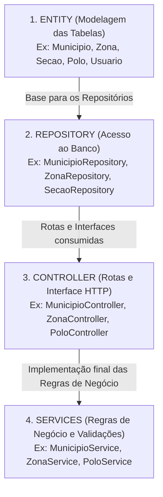

# Projeto CEPE — Consulta Eleitoral de Pernambuco

## 📖 Sobre o Projeto

O **CEPE (Consulta Eleitoral de Pernambuco)** é uma aplicação web desenvolvida para centralizar, organizar e consultar informações essenciais do ecossistema eleitoral do estado de Pernambuco. O sistema permite a consulta detalhada de **Zonas Eleitorais**, **Municípios**, **Polos** e **Seções de Votação**, além do cadastro e gerenciamento de **Usuários**.

Na primeira execução com o banco de dados vazio, a aplicação realiza a **importação e tratamento automatizado** dos dados contidos nos arquivos CSV localizados em `src/main/resources/csv/` (como `secoes.csv`), populando o banco de dados PostgreSQL e estabelecendo os relacionamentos relacionais automaticamente.

---

## 🛠️ Tecnologias Utilizadas

* **Linguagem:** Java 21
* **Backend Framework:** Spring Boot 3.x
* **Acesso a Dados / ORM:** Spring Data JPA / Hibernate
* **Servidor Web & MVC:** Spring Web (Spring MVC)
* **Template Engine:** Thymeleaf
* **Estilização / UI:** Bootstrap & CSS Customizado
* **Banco de Dados:** PostgreSQL
* **Gerenciador de Build:** Maven (`mvnw` / `mvnw.cmd`)

---

## 🗃️ Estrutura de Dados & Entidades JPA

A base de dados relacional foi modelada para armazenar de forma normalizada os dados eleitorais importados.

### Entidades JPA e Atributos:

1. **`Zona`** (Tabela `zona`)
   * `numero` (Integer - Chave Primária)
   * `municipioSede` (`@ManyToOne` com `Municipio`)
   * `municipios` (`@ManyToMany` com `Municipio` via tabela `zona_municipio`)
   * `secoes` (`@OneToMany` com `Secao`)

2. **`Municipio`** (Tabela `municipio`)
   * `codTse` (Integer - Chave Primária - Código TSE)
   * `nome` (String - Nome do Município)
   * `numeroPolo` (Integer)
   * `polo` (`@ManyToOne` com `Polo`)
   * `zonas` (`@ManyToMany(mappedBy = "municipios")`)

3. **`Polo`** (Tabela `polo`)
   * `numero` (Integer - Chave Primária)
   * `municipioSede` (`@OneToOne` com `Municipio`)
   * `municipios` (`@OneToMany` com `Municipio`)

4. **`Secao`** (Tabela `secao`)
   * `id` (Long - Chave Primária, Autoincremento)
   * `numero` (Integer - Número da Seção)
   * `zona` (`@ManyToOne` com `Zona`)
   * `municipio` (`@ManyToOne` com `Municipio`)
   * `polo` (`@ManyToOne` com `Polo`)

5. **`Usuario`** (Tabela `usuarios`)
   * `cpf` (String - Chave Primária, Única, Não Nula)
   * `nome` (String - Nome do Usuário)
   * `email` (String - E-mail do Usuário, Único)

### Resumo dos Relacionamentos

* **Zonas e Municípios:** Relação Muitos-para-Muitos (`@ManyToMany zona_municipio`).
* **Zonas e Seções:** Relação Um-para-Muitos (`1-para-n`).
* **Polos e Municípios:** Relação Um-para-Muitos (`1-para-n`) e Município Sede (`1-para-1`).
* **Seções e Demais Entidades:** Cada Seção pertence a uma `Zona`, um `Municipio` e um `Polo` (`n-para-1`).

---

## ✨ Funcionalidades

### 1. Consultas de Zonas Eleitorais
* Buscar Zona Eleitoral pelo seu número.
* Listar o município sede de uma determinada zona.
* Listar todos os municípios que compõem uma zona.
* Listar todas as seções de votação associadas a uma zona.

### 2. Consultas de Municípios
* Buscar Município pelo código TSE ou nome.
* Listar as zonas eleitorais que abrangem o município.
* Listar todas as seções de votação pertencentes a um município.

### 3. Consultas de Polos Eleitorais
* Listar todos os municípios vinculados a um determinado polo.
* Listar todas as zonas eleitorais integrantes de um polo.
* Consultar o número do polo a partir de um município ou de uma zona eleitoral.

### 4. Cadastro e Gestão de Usuários
* Formulário para inclusão de novos usuários (CPF, Nome, E-mail com DTO e validações).
* Listagem e consulta de usuários cadastrados no sistema.

### 5. Carga Inicial de Dados (Importação Automatizada)
* Ao iniciar a aplicação com a base limpa, o componente `DataInitializer` executa o `ImportacaoService`, que lê os arquivos CSV (`secoes.csv`, etc.) e popula o PostgreSQL de forma automatizada e segura.

---

## 🏛️ Arquitetura do Sistema (*Package by Layer*)

O projeto é organizado seguindo o padrão **Package by Layer**, dividindo as classes por suas responsabilidades técnicas:

```text
cepe/
├── CepeApplication.java # Classe Principal de Inicialização Spring Boot
├── controller/          # 🌐 Rotas MVC / Controllers (MunicipioController, etc.)
├── service/             # ⚙️ Regras de Negócio e Casos de Uso (MunicipioService, etc.)
│   └── importacao/      # 📦 Leitura de CSVs e Carga Inicial de Dados
├── repository/          # 🗄️ Interfaces de Persistência Spring Data JPA
├── domain/entity/       # 🧱 Entidades JPA (Municipio, Zona, Secao, Polo, Usuario)
└── dto/                 # 📄 DTOs para Tráfego de Dados Seguro (UsuarioDto, etc.)
```

### 🔁 Fluxo de Programação vs. Fluxo de Execução

#### Ordem de Programação (Fluxo de Desenvolvimento - Bottom-Up)


#### Ordem de Execução pelo Sistema (Fluxo de Chamada em Execução - Top-Down)

```mermaid
flowchart LR
    APP["APP / Cliente<br/>(Navegador / Web)"]
    Controller["Controller<br/>(Mundo Exterior)"]
    Service["Service<br/>(Regras de Negócio)"]
    Repository["Repository<br/>(Conexão com os Dados)"]
    Database[("Banco PostgreSQL /<br/>Entities")]

    APP -->|1. Requisição HTTP| Controller
    Controller -->|2. Chamada de Negócio| Service
    Service -->|3. Consulta / Persistência| Repository
    Repository -->|4. Execução SQL| Database
    Database -.->|5. Retorno de Entidades| Repository
    Repository -.->|6. Dados / DTOs| Service
    Service -.->|7. Resposta Processada| Controller
    Controller -.->|8. HTML / JSON| APP
```


---

## 🚀 Como Executar o Projeto

Siga os passos abaixo para configurar e executar a aplicação no seu ambiente local.

### Pré-requisitos
* **Java JDK 21** instalado e configurado nas variáveis de ambiente.
* **PostgreSQL** em execução.
* **Git** instalado.

### Passos para Execução

1. **Clone o repositório:**
   ```bash
   git clone https://github.com/JoaoLRS/CEPE.git
   cd CEPE
   ```

2. **Configure o Banco de Dados:**
   * Crie um banco de dados no PostgreSQL com o nome `cepe`:
     ```sql
     CREATE DATABASE cepe;
     ```
   * Verifique o arquivo `src/main/resources/application.properties`.
   * Defina a variável de ambiente `SENHA_DB` com a senha do seu usuário PostgreSQL:
     - **PowerShell (Windows):** `$env:SENHA_DB="sua_senha"`
     - **Bash (Linux/macOS):** `export SENHA_DB="sua_senha"`

3. **Importação Automatizada dos Dados:**
   * Não é necessário rodar scripts SQL manuais. Na primeira execução, o Spring Boot lerá os arquivos CSV em `src/main/resources/csv/` e importará automaticamente os Municípios, Zonas, Polos e Seções.

4. **Execute a Aplicação:**
   * No Windows (PowerShell/CMD):
     ```powershell
     .\mvnw.cmd spring-boot:run
     ```
   * No Linux/macOS:
     ```bash
     ./mvnw spring-boot:run
     ```

5. **Acesse a Aplicação:**
   * Abra o navegador e acesse: [http://localhost:8080/inicio](http://localhost:8080/inicio)
